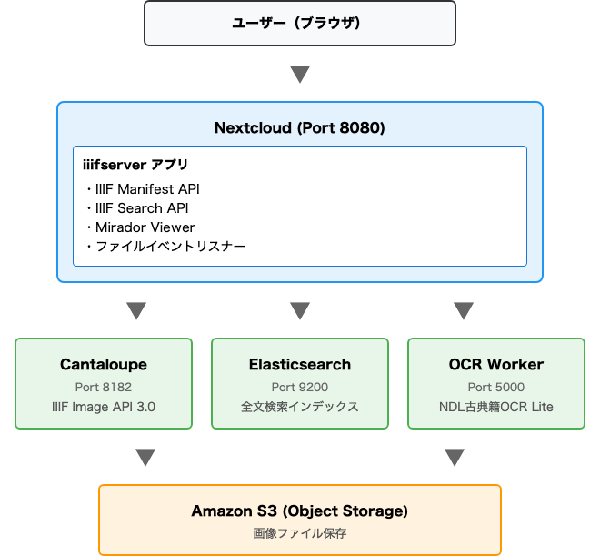
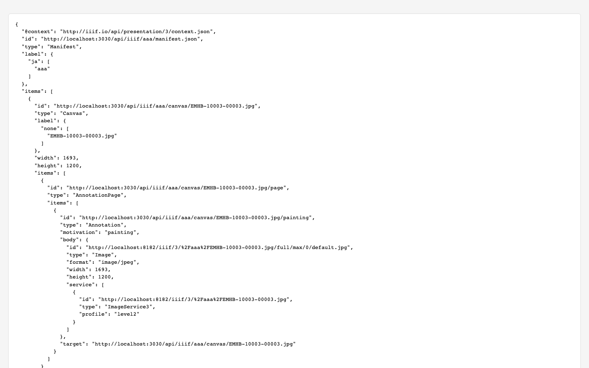
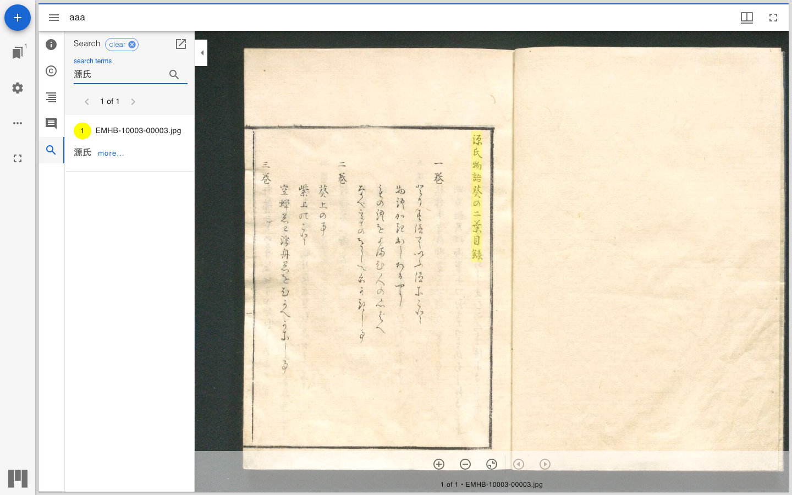
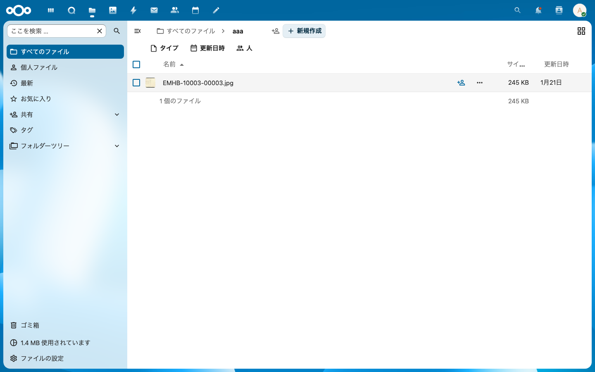
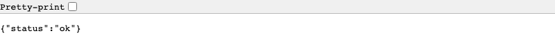
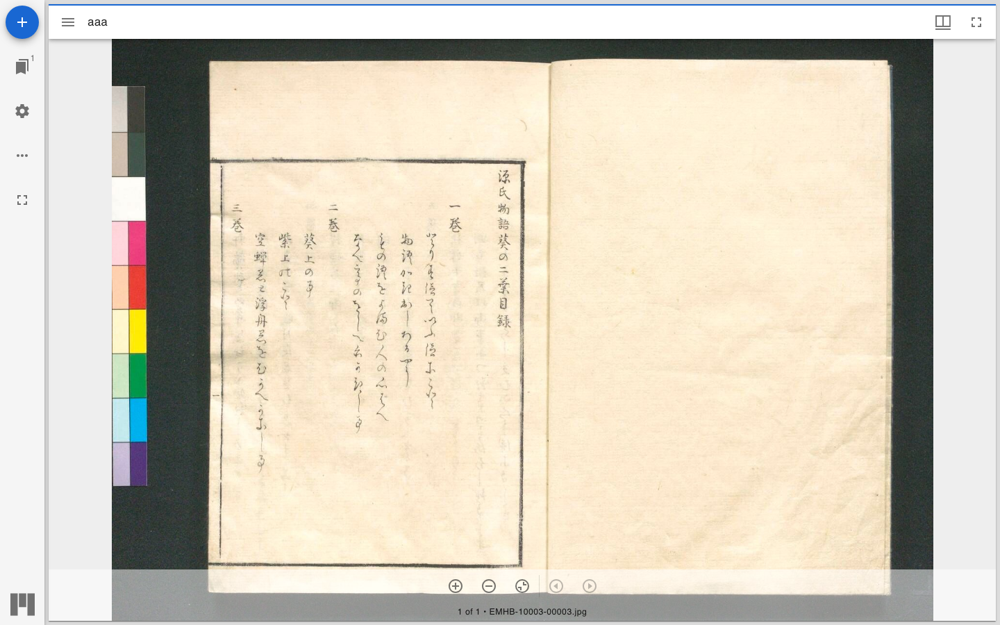
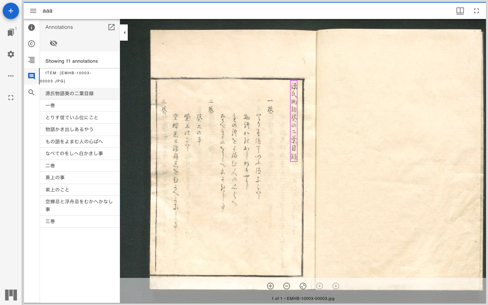
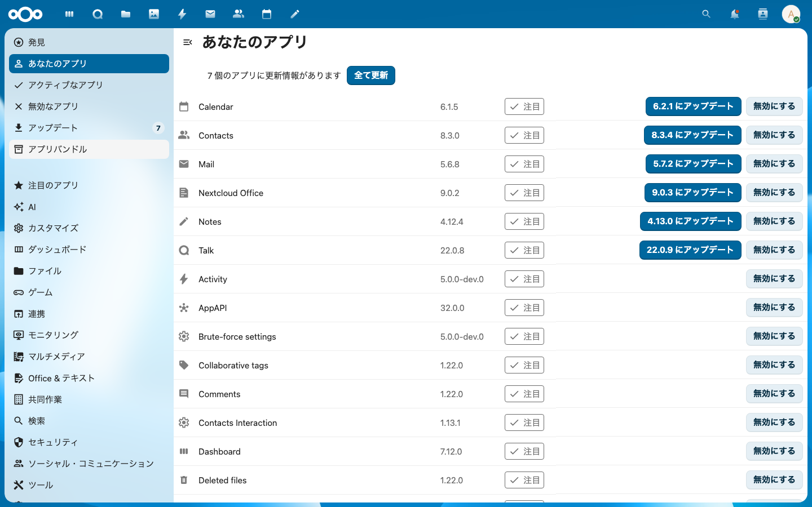
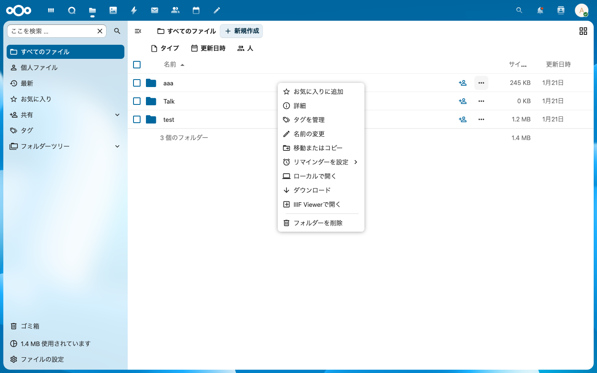
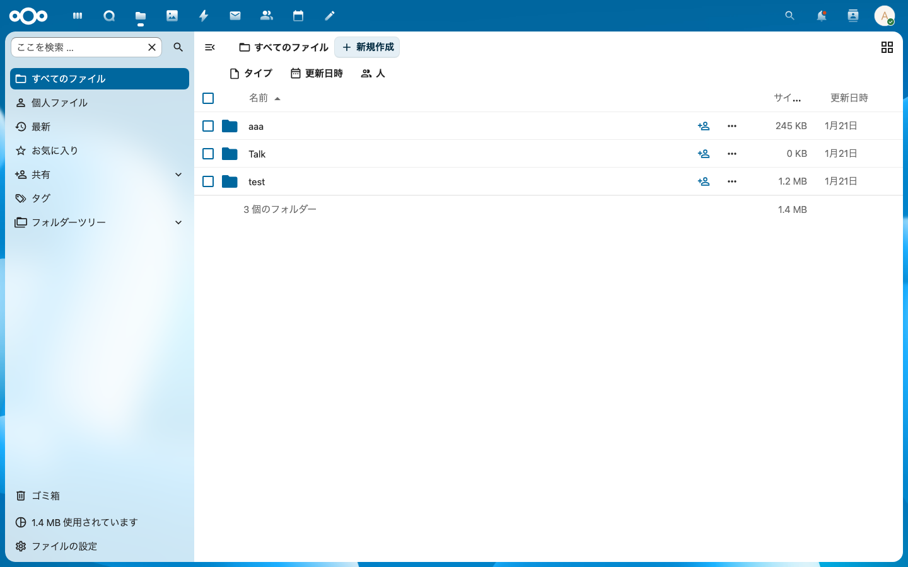

# NextcloudでIIIF画像サーバーとOCR全文検索を構築する

## はじめに

本記事では、Nextcloudをベースとした画像管理システムに、IIIF（International Image Interoperability Framework）対応の画像配信機能と、NDL古典籍OCRを活用した全文検索機能を実装する方法を解説します。

### 実現する機能

1. **IIIF Presentation API 3.0対応** - フォルダ内の画像をIIIF Manifest形式で配信
2. **IIIF Image API 3.0対応** - Cantaloupeによる高解像度画像のタイル配信
3. **IIIF Content Search API 1.0対応** - OCRテキストによる全文検索
4. **自動OCR処理** - 画像アップロード時に即座にOCRを実行
5. **Miradorビューワ統合** - 高機能なIIIFビューワをNextcloud内に組み込み

---

## システム構成

### アーキテクチャ概要



### 使用技術

| コンポーネント | 技術 | 役割 |
|---------------|------|------|
| Nextcloud | PHP 8.x | ファイル管理、ユーザー認証 |
| iiifserver | Nextcloud App (PHP) | IIIF API、イベント処理 |
| Cantaloupe | Java | IIIF Image API 3.0サーバー |
| Elasticsearch | 8.11 | 全文検索インデックス |
| OCR Worker | Python + Flask | OCR処理API |
| NDL古典籍OCR Lite | Python | 日本語古典籍OCR |
| Mirador | JavaScript | IIIFビューワ |

---

## 実装詳細

### 1. Nextcloudアプリ「iiifserver」の構成

```
iiifserver/
├── appinfo/
│   ├── info.xml          # アプリ定義
│   └── routes.php        # URLルーティング
├── lib/
│   ├── AppInfo/
│   │   └── Application.php    # アプリ初期化、イベントリスナー登録
│   ├── Controller/
│   │   ├── IiifController.php # IIIF API エンドポイント
│   │   └── PageController.php # Viewerページ
│   ├── Listener/
│   │   ├── FileUploadListener.php  # アップロード検知
│   │   └── FileDeleteListener.php  # 削除検知
│   └── Service/
│       └── OcrService.php     # OCR Worker API呼び出し
├── templates/
│   └── viewer.php        # Miradorビューワテンプレート
├── js/
│   ├── iiifserver-main.js    # メインJS（ビルド済み）
│   └── mirador.min.js        # Miradorライブラリ
├── css/
│   └── viewer.css
└── src/
    └── main.js           # FileActionの登録
```

### 2. IIIF Manifest API の実装

`IiifController.php` では、フォルダ内の画像をIIIF Presentation API 3.0形式のManifestとして返します。

```php
public function manifest(string $folder): JSONResponse {
    $folderParam = urldecode($folder);
    $folderPath = '/' . ltrim($folderParam, '/');

    // ログインユーザーのフォルダから画像ファイルを取得
    $files = $this->getFilesInFolder($folderPath);

    $items = [];
    foreach ($files as $file) {
        // Cantaloupeから画像サイズを取得
        $imageInfo = $this->getImageInfo($identifier);

        // Canvas（ページ）を構築
        $items[] = [
            'id' => $appUrl . '/iiif/' . $folderUrlPart . '/canvas/' . $canvasId,
            'type' => 'Canvas',
            'label' => ['none' => [$filename]],
            'width' => $imageInfo['width'],
            'height' => $imageInfo['height'],
            'items' => [/* AnnotationPage with painting annotation */],
            'annotations' => [/* 外部アノテーションへの参照 */]
        ];
    }

    $manifest = [
        '@context' => 'http://iiif.io/api/presentation/3/context.json',
        'id' => $appUrl . '/iiif/' . $folderUrlPart . '/manifest',
        'type' => 'Manifest',
        'label' => ['ja' => [basename($folderPath)]],
        'items' => $items,
        'service' => [/* IIIF Search Service */]
    ];

    return new JSONResponse($manifest);
}
```


*ブラウザでIIIF Manifest JSONを表示した画面*

### 3. IIIF Content Search API の実装

ElasticsearchにインデックスされたOCRテキストを検索し、IIIF Content Search API 1.0形式で結果を返します。

```php
public function search(string $folder): JSONResponse {
    $query = $this->request->getParam('q', '');

    // Elasticsearchで検索
    $results = $this->searchElasticsearch($query, $folderPath);

    $resources = [];
    $hits = [];

    foreach ($results as $hit) {
        $bboxes = $hit['_source']['bounding_boxes'] ?? [];

        // 検索クエリにマッチするバウンディングボックスを抽出
        $matchingBoxes = array_filter($bboxes, function($box) use ($query) {
            return mb_strpos(mb_strtolower($box['text']), mb_strtolower($query)) !== false;
        });

        foreach ($matchingBoxes as $box) {
            $xywh = $this->bboxToXywh($box['bbox']);

            $resources[] = [
                '@id' => $annotationId,
                '@type' => 'oa:Annotation',
                'motivation' => 'sc:painting',
                'resource' => [
                    '@type' => 'cnt:ContentAsText',
                    'chars' => $box['text']
                ],
                'on' => $canvasUrl . '#xywh=' . $xywh
            ];
        }
    }

    return new JSONResponse([
        '@context' => 'http://iiif.io/api/search/1/context.json',
        '@type' => 'sc:AnnotationList',
        'resources' => $resources,
        'hits' => $hits
    ]);
}
```


*Miradorの検索パネルで「源氏」を検索し、画像上の該当箇所がハイライト表示される*

### 4. ファイルイベントリスナーによる自動OCR

Nextcloudのイベントシステムを利用して、ファイルのアップロード・削除を検知します。

#### Application.php でのイベント登録

```php
public function register(IRegistrationContext $context): void {
    // ファイルアップロード時
    $context->registerEventListener(NodeCreatedEvent::class, FileUploadListener::class);
    $context->registerEventListener(NodeWrittenEvent::class, FileUploadListener::class);

    // ファイル削除時
    $context->registerEventListener(NodeDeletedEvent::class, FileDeleteListener::class);
}
```

#### FileUploadListener.php

```php
public function handle(Event $event): void {
    $node = $event->getNode();

    // 画像ファイルのみ処理
    if (!($node instanceof File) || !$this->ocrService->isImageFile($node)) {
        return;
    }

    $fileId = $node->getId();
    $relativePath = preg_replace('#^/[^/]+/files/#', '', $node->getPath());

    // OCR Workerに処理を依頼
    $this->ocrService->processFileById($fileId, $relativePath);
}
```


*Nextcloudのtestフォルダ内にアップロードされた画像ファイル*

### 5. OCR Worker の実装

Python + Flask で実装されたOCR処理APIです。

#### APIエンドポイント

| エンドポイント | メソッド | 説明 |
|---------------|----------|------|
| `/health` | GET | ヘルスチェック |
| `/process` | POST | ファイルパスでOCR実行 |
| `/process-by-id` | POST | ファイルIDでOCR実行 |
| `/delete` | POST | ファイルのインデックス削除 |
| `/delete-folder` | POST | フォルダ内全ファイルの削除 |

#### OCR処理フロー

```python
def process_file_direct(self, s3_key, file_id, file_path):
    # 1. S3からファイルをダウンロード
    response = self.s3.get_object(Bucket=S3_BUCKET, Key=s3_key)
    image_data = response['Body'].read()

    # 2. NDL古典籍OCR Liteでテキスト抽出
    ocr_result = self._perform_ocr(image_data, filename)

    # 3. Elasticsearchにインデックス
    iiif_doc = {
        'file_id': file_id,
        'title': file_path,
        'folder': folder,
        'content': ocr_result['text'],
        'bounding_boxes': ocr_result['bounding_boxes'],
        'image_width': width,
        'image_height': height,
        'ocr_engine': 'ndl-kotenocr-lite'
    }
    self.es.index(index=IIIF_INDEX, id=doc_id, body=iiif_doc)
```


*OCR Worker APIの正常稼働を確認（`/health`エンドポイント）*

### 6. Elasticsearchインデックス設計

```json
{
  "mappings": {
    "properties": {
      "file_id": { "type": "keyword" },
      "title": {
        "type": "text",
        "fields": { "keyword": { "type": "keyword" } }
      },
      "folder": { "type": "keyword" },
      "content": { "type": "text", "analyzer": "standard" },
      "content_ja": { "type": "text", "analyzer": "cjk" },
      "bounding_boxes": {
        "type": "nested",
        "properties": {
          "text": { "type": "text" },
          "bbox": { "type": "integer" },
          "confidence": { "type": "float" }
        }
      },
      "image_width": { "type": "integer" },
      "image_height": { "type": "integer" },
      "ocr_hash": { "type": "keyword" },
      "ocr_timestamp": { "type": "date" }
    }
  }
}
```

### 7. Miradorビューワの組み込み

Nextcloudのセキュリティポリシー（CSP）に対応するため、Miradorはローカルにホストし、nonceを使用してインラインスクリプトを許可します。

```php
<!-- viewer.php -->
<script nonce="<?php p(\OC::$server->getContentSecurityPolicyNonceManager()->getNonce()); ?>"
        src="<?php p(\OC::$server->getURLGenerator()->linkTo('iiifserver', 'js/mirador.min.js')); ?>">
</script>
<script nonce="<?php p(\OC::$server->getContentSecurityPolicyNonceManager()->getNonce()); ?>">
    Mirador.viewer({
        id: 'mirador-container',
        windows: [{ manifestId: manifestUrl }],
        window: {
            panels: {
                info: true,
                annotations: true,
                search: true
            }
        }
    });
</script>
```


*Miradorビューワで古典籍画像を閲覧*


*OCRで抽出されたテキストがアノテーションとして表示され、画像上にバウンディングボックスがオーバーレイされる*

---

## docker-compose.yml

```yaml
services:
  nextcloud:
    build: .
    ports:
      - "8080:80"
    volumes:
      - nextcloud_data:/var/www/html
      - ./iiifserver:/var/www/html/custom_apps/iiifserver
    environment:
      - OBJECTSTORE_S3_BUCKET=${S3_BUCKET}
      - OBJECTSTORE_S3_KEY=${S3_ACCESS_KEY}
      - OBJECTSTORE_S3_SECRET=${S3_SECRET_KEY}

  elasticsearch:
    image: elasticsearch:8.11.0
    environment:
      - discovery.type=single-node
      - xpack.security.enabled=false

  cantaloupe:
    build: ./cantaloupe
    ports:
      - "8182:8182"

  ocr-worker:
    build: ./ocr-worker
    ports:
      - "5050:5000"
    environment:
      - S3_BUCKET=${S3_BUCKET}
      - ELASTICSEARCH_URL=http://elasticsearch:9200
```

---

## 使い方

### 1. アプリの有効化

```bash
docker exec nextcloud php occ app:enable iiifserver
```


*Nextcloud管理画面のアプリ一覧*

### 2. フォルダをIIIF Viewerで開く

1. Nextcloudのファイル一覧でフォルダを右クリック
2. 「IIIF Viewerで開く」を選択


*フォルダを右クリックすると「IIIF Viewerで開く」メニューが表示される*

### 3. 画像のアップロードと自動OCR

1. Nextcloudに画像をアップロード
2. 自動的にOCRが実行される
3. 検索可能になる


*Nextcloudのファイル一覧。アップロードされたファイルは自動的にOCR処理される*

### 4. テキスト検索

Miradorの検索パネルでテキストを入力すると、OCRで抽出されたテキストから検索できます。


*Miradorの検索パネルで「源氏」を検索。該当箇所が画像上にハイライト表示され、サイドパネルに検索結果一覧が表示される*

---

## トラブルシューティング

### CSPエラーでスクリプトが読み込めない

Nextcloudの `strict-dynamic` CSPポリシーにより、外部CDNからのスクリプト読み込みがブロックされます。対策：

1. Miradorをローカルにダウンロード
2. `nonce` 属性を使用してスクリプトを読み込む

### OCRが実行されない

1. OCR Workerが起動しているか確認
   ```bash
   docker logs ocr_worker
   ```
2. S3の認証情報が正しいか確認
3. Elasticsearchが起動しているか確認


*OCR Workerが正常に動作している状態*

---

## まとめ

本記事では、NextcloudにIIIF対応機能とOCR全文検索を追加する方法を解説しました。主なポイント：

- **Nextcloudアプリとして実装** - PHPでIIIF APIを提供
- **イベント駆動OCR** - ファイルアップロード時に即座にOCR実行
- **IIIF標準準拠** - Presentation API 3.0、Content Search API 1.0に対応
- **日本語古典籍対応** - NDL古典籍OCR Liteによる高精度な日本語OCR

この構成により、Nextcloudをベースとした本格的なデジタルアーカイブシステムを構築できます。

---

## 参考リンク

- [IIIF Presentation API 3.0](https://iiif.io/api/presentation/3.0/)
- [IIIF Content Search API 1.0](https://iiif.io/api/search/1.0/)
- [NDL古典籍OCR Lite](https://github.com/ndl-lab/ndlkotenocr-lite)
- [Mirador](https://projectmirador.org/)
- [Cantaloupe](https://cantaloupe-project.github.io/)
- [Nextcloud App Development](https://docs.nextcloud.com/server/latest/developer_manual/)
